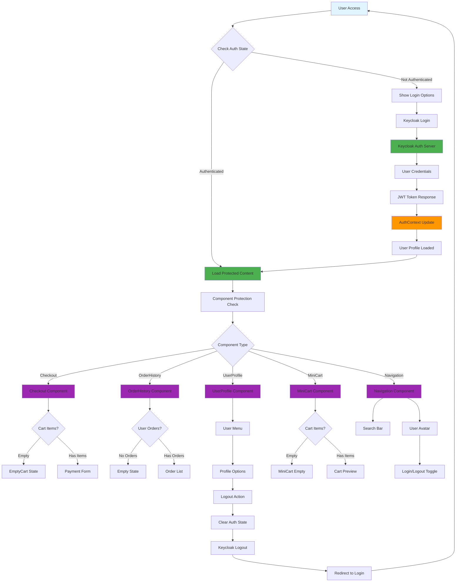

# GOG Clone - AEM SPA Project

## Project Overview
A GOG.com inspired game store built with Adobe Experience Manager (AEM) as a Single Page Application (SPA) using React. This project demonstrates a full-featured e-commerce platform with authentication, shopping cart, and content management capabilities.

## 📚 Documentation
For detailed technical specifications and configuration guides, please refer to the documentation in the `docs/` folder:
- **[Technical Specification](docs/tech_spec.md)** - Comprehensive architecture, components, and development guidelines
- **[Keycloak Configuration](docs/keycloak_config.md)** - Authentication server setup and configuration
- **[Project Roadmap](docs/roadmap.md)** - Development phases, completed features, and future plans

## 🚀 Quick Start

### Prerequisites
- **Java 11+** - Required for AEM and Maven
- **Maven 3.6.3+** - Build tool for AEM project
- **Node.js 14+** - Frontend development
- **Docker & Docker Compose** - For Keycloak authentication server
- **AEM 6.5+** - Adobe Experience Manager instance

### Local Development Setup

#### 1. Clone the Repository
```bash
git clone <repository-url>
cd gogstore
```

#### 2. Start Authentication Server
```bash
# Navigate to docs folder for Keycloak setup
cd docs
docker-compose up -d
```
This will start Keycloak with PostgreSQL backend. See [Keycloak Configuration](docs/keycloak_config.md) for detailed setup instructions.

#### 3. Configure Environment Variables
Create a `.env.local` file in the project root with the following variables:
```bash
REACT_APP_KEYCLOAK_URL=http://localhost:8080
REACT_APP_KEYCLOAK_REALM=gogstore
REACT_APP_KEYCLOAK_CLIENT_ID=gogstore-frontend
REACT_APP_PROXY_ENABLED=true
REACT_APP_PAGE_MODEL_PATH=/content/gogstore/us/en.model.json
REACT_APP_API_HOST=http://localhost:4502
REACT_APP_ROOT=/content/gogstore/us/en/home.html
```

#### 4. Build and Deploy to AEM
```bash
# Build the entire project
mvn clean install -PautoInstallPackage

# Deploy to AEM (ensure AEM instance is running on localhost:4502)
# The build process will automatically deploy packages to AEM
```

#### 5. Start Frontend Development
```bash
cd ui.frontend
npm install
npm start
```

#### 6. Access the Application
- **AEM Author**: http://localhost:4502/editor.html/content/gogstore/us/en/home.html
- **Published Site**: http://localhost:4503/content/gogstore/us/en/home.html
- **Keycloak Admin**: http://localhost:8080 (admin/admin_password)

## 🏗️ Project Structure

### AEM Modules
- **`core/`** - Backend Java logic, Sling Models, and services
- **`ui.apps/`** - AEM components, templates, and client libraries
- **`ui.content/`** - Content structure, pages, and initial content
- **`ui.config/`** - OSGi configurations and context-aware configurations
- **`ui.frontend/`** - React SPA frontend application
- **`dispatcher/`** - Dispatcher configuration for publishing
- **`all/`** - Parent POM that aggregates all modules

### Content Model (AEM Content Fragments)

#### Jogo (Game)
- `title` - Game title
- `description` - Game description
- `price` - Base price
- `score` - Rating score
- `discountValue` - Discount percentage
- `releaseDate` - Release date
- `genre` - Game genre (selector)
- `developer` - Developer reference
- `imageList` - Game screenshots and artwork

#### Desenvolvedor (Developer)
- `title` - Developer name
- `image` - Developer logo

#### Destaque (Highlight)
- `title` - Highlight title
- `externalLink` - External URL
- `image` - Banner image

## 🎯 Implemented Features

### Core Components

1. **Carousel**
   - Title

2. **Game List**
   - Grid/List View Toggle
   - Filtering Options
   - Sorting Options
   - Pagination
   - Game Cards

3. **Game Detail**
   - Game Title
   - Hero Image
   - Screenshots Gallery
   - Description
   - Price & Purchase Options
   - System Requirements
   - Reviews & Ratings

4. **Search & Filter**
   - Search Bar
   - Genre Filter
   - Price Range
   - Platform Filter
   - Release Date Filter
   - Sort Options

5. **Navigation**
   - Main Menu
   - User Menu
   - Breadcrumbs
   - Footer Navigation

6. **Highlight**
   - Featured Content
   - Promotional Banners
   - New Releases
   - Special Offers

7. **MiniCart**
   - Dropdown with cart items
   - Quantity controls
   - Remove items
   - Checkout button with auth check

8. **UserProfile** (Header Component)
   - User avatar and name from Keycloak
   - Dropdown menu with profile options
   - Quick stats (cart items, favorites, orders)
   - Logout functionality
   - Bootstrap styling

9. **LoginPrompt** (AEM Component)
   - Keycloak integration
   - Configurable post-login redirect
   - Visual countdown with progress bar
   - Configurable via AEM dialog:
     - `postLoginDestination`: Página de destino
     - `redirectionTimeout`: Tempo de redirecionamento (segundos)
     - `shouldRedirect`: Ativar/desativar redirecionamento
     - `showLogout`: Exibir botão de logout

10. **Checkout** (Modular)
    - OrderSummary: Resumo do pedido com desconto de 10%
    - PaymentForm: Formulário de pagamento (Cartão/PIX)
    - AuthRequired: Tela para usuários não autenticados
    - EmptyCart: Tela para carrinho vazio
    - Integração com CartContext e AuthContext
    - Advanced form validation and real-time formatting:
      - CPF: `123.456.789-11` automatic formatting
      - Credit card: `1234 5678 9012 3456` spacing
      - Expiry: `MM/AA` format
      - CEP: `12345-678` formatting
      - Phone: `(11) 11111-1111` automatic formatting
      - Email auto-lowercase and state uppercase conversion
    - Comprehensive validation with detailed error messages

11. **SearchFilter** (Search Page)
    - URL parameter support (`?q=term`)
    - Automatic search execution from Navigation
    - Integration with existing filters and GraphQL API
    - Game filtering with sidebar (genre, developer, score, discount)
    - Grid display of search results with Gameitem components

12. **Footer** (Layout Component)
    - Proper footer layout with flexbox
    - AEM SPA Editor compatible (no vh/vw units)
    - Consistent dark theme styling

13. **OrderHistory** (User Dashboard Component)
    - Complete order history display
    - Date filtering functionality
    - Pagination support
    - Order status tracking (completed, processing, cancelled)
    - Payment method display
    - Order items with images and details
    - Discount information
    - Responsive design
    - Integration with Keycloak authentication

14. **Banner** (Content Display Component)
    - Dynamic banner content display
    - AEM content fragment integration
    - Responsive image handling
    - Click-through support for external links

<!-- 15. **AuthRequired** (Authentication Component)
    - Reusable authentication gate
    - Customizable messages and icons
    - Multiple icon options (lock, shopping-bag, package)
    - Integration with Keycloak
    - Responsive design

16. **Loading** (UI State Component)
    - Customizable loading states
    - Multiple icon options (cart, package, refresh, loader)
    - Size variations (small, medium, large)
    - Custom message support
    - Spinner animation options -->

## 🛠️ Technical Architecture

### Frontend Stack
- **React 16** with TypeScript support
- **Bootstrap 5** for responsive design
- **React Router v5** for navigation
- **Context API** for state management
- **Keycloak-js** for authentication
- **AEM SPA Editor** integration

### Backend Stack
- **AEM 6.5+** as content management system
- **Sling Models** for component logic
- **Content Fragments** for structured content
- **OSGi Services** for business logic
- **GraphQL** for data queries
- **Servlets** for REST API endpoints

### State Management
- **CartContext** - Shopping cart state with localStorage persistence
- **AuthContext** - Authentication state with Keycloak integration
- **Component state** - Local component-level state

### Integration Points
- **AEM SPA Editor** - Content authoring capabilities
- **Keycloak** - Authentication and user management
- **GraphQL API** - Content retrieval
- **REST APIs** - Backend services and order processing
- **Content Fragment Servlets** - Order creation and management
- **AEM Content Fragments** - Order data persistence

## 🔧 Development Guidelines

### Code Organization
- Frontend code in `ui.frontend/src/`
- Components organized by feature
- Shared utilities and constants
- TypeScript for type safety

### Styling Approach
- Bootstrap 5 as base framework
- CSS custom properties for theming
- Component-specific styles
- Responsive design principles

### Authentication Flow
1. User clicks login button
2. Redirect to Keycloak login page
3. Authentication with JWT tokens
4. Redirect back with token
5. User profile loaded in header

### Search Implementation
1. User searches via navigation bar
2. Redirect to `/search.html?q=term`
3. SearchFilter reads URL parameters
4. Execute search via GraphQL
5. Display results with filters

## � Authentication & Security Flow



### Security Components Integration

| Component | Auth Usage | Protection Level | Features |
|-----------|-------------|------------------|----------|
| **AuthContext** | Central auth state | Global | JWT parsing, token refresh, Keycloak integration |
| **Checkout** | Required | Full | Payment protection, user validation |
| **OrderHistory** | Required | Full | Order access control, user-specific data |
| **UserProfile** | Required | Full | Profile management, logout functionality |
| **MiniCart** | Conditional | Partial | Checkout button protection |
| **Navigation** | Conditional | Partial | Login state display, search access |
| **LoginPrompt** | Optional | Component | Configurable redirects, countdown timers |
| **AuthRequired** | Global | Full | Reusable auth gates, customizable messages |

### Security Flow Details

1. **Initialization**: AuthContext initializes with Keycloak configuration
2. **SSO Check**: Automatic SSO verification on app load
3. **Token Management**: JWT parsing and automatic refresh (30s intervals)
4. **Component Protection**: Each component checks auth state before rendering
5. **Route Protection**: Protected routes redirect to login if not authenticated
6. **User Data**: Profile information extracted from JWT token
7. **Logout Flow**: Complete state clearing and Keycloak logout

## �📋 Build & Deployment

### Local Development
```bash
# Frontend development
cd ui.frontend
npm install
npm start

# Full project build
mvn clean install

# Deploy to AEM
mvn clean install -PautoInstallPackage
```

### Production Build
```bash
# Optimized frontend build
cd ui.frontend
npm run build

# Full production build
mvn clean install -Pproduction
```

### Environment Configuration
- Development: `.env.development`
- Production: `.env.production`
- Local overrides: `.env.local`

## 🧪 Testing

### Frontend Testing
```bash
cd ui.frontend
npm test
npm run test:coverage
```

### Backend Testing
```bash
mvn test
mvn verify
```

### E2E Testing
```bash
cd ui.tests
npm run cypress:open
npm run cypress:run
```

## 🔐 Security Considerations

- **Authentication** - Keycloak OAuth2 with JWT tokens
- **Authorization** - Role-based access control
- **Data Validation** - Input sanitization and validation
- **CORS** - Proper cross-origin configuration
- **HTTPS** - SSL/TLS encryption in production

## 🚀 Deployment Options

### Local Development
- AEM Author: http://localhost:4502
- AEM Publish: http://localhost:4503
- Frontend Dev: http://localhost:3000

### Cloud Deployment
- Adobe Cloud Manager
- Docker containers
- Kubernetes orchestration

### Infrastructure Requirements
- **Minimum RAM**: 4GB for AEM
- **Recommended RAM**: 8GB+ for development
- **Disk Space**: 10GB+ for AEM repository
- **Network**: Stable internet connection for dependencies

## 📚 Additional Resources

### Documentation References
- **[Technical Specification](docs/tech_spec.md)** - Detailed architecture and component documentation
- **[Keycloak Configuration](docs/keycloak_config.md)** - Authentication server setup guide
- **[Project Roadmap](docs/roadmap.md)** - Development phases, completed features, and future plans

### External Documentation
- [AEM SPA Editor Documentation](https://experienceleague.adobe.com/docs/experience-manager-learn/getting-started-wknd-tutorial-develop/spa-editor.html)
- [React Documentation](https://reactjs.org/docs/)
- [Bootstrap 5 Documentation](https://getbootstrap.com/docs/)
- [Keycloak Documentation](https://www.keycloak.org/documentation)

### Community & Support
- AEM Community Forums
- React Community
- Stack Overflow tags: `aem`, `react`, `keycloak`

## 🤝 Contributing

### Development Workflow
1. Fork the repository
2. Create feature branch
3. Make changes with tests
4. Submit pull request
5. Code review and merge

### Code Standards
- ESLint for JavaScript/TypeScript
- Prettier for code formatting
- Conventional commits for messages
- Documentation updates required

## 📈 Project Status

### Completed Features ✅
- Core shopping experience
- User authentication with Keycloak
- Search functionality with URL routing
- Form validation and formatting
- Responsive design
- Content management
- **Order management system** (NEW v2)
- **Order history and tracking** (NEW v2)
- **Complete checkout flow** (NEW v2)
- **Payment processing integration** (NEW v2)
- **Global reusable components** (NEW v2)

### In Progress 🚧
- User dashboard enhancements
- Advanced order analytics
- Payment gateway integration (real payment processing)
- Unit tests
- Integration tests

### Planned Features 📋
- Multi-language support
- Regional pricing
- Advanced analytics
- Performance optimization
- Cloud migration
- Email notifications for orders
- Order cancellation and refunds
- Wishlist functionality
- Product reviews and ratings

## 🐛 Troubleshooting

### Common Issues
- **Build failures**: Check Java version and Maven configuration
- **Authentication errors**: Verify Keycloak is running and configured
- **AEM connection**: Ensure AEM instance is accessible
- **Frontend errors**: Check environment variables and dependencies

### Debug Commands
```bash
# Check AEM logs
tail -f crx-quickstart/logs/error.log

# Check frontend build
cd ui.frontend && npm run build --verbose

# Test Keycloak connection
curl http://localhost:8080/realms/gogstore
```

### Support Channels
- Project maintainers
- AEM support team
- Community forums
- Stack Overflow

---

**Last Updated**: $(date)  
**Version**: 1.0.0  
**Maintainers**: AEM Development Team

